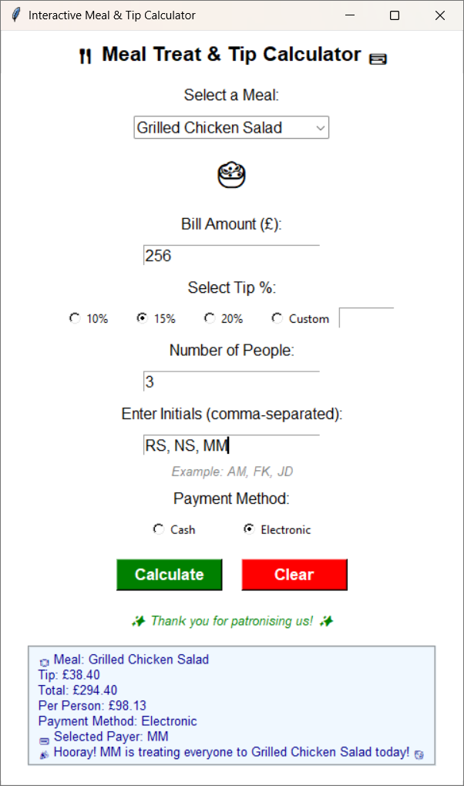

# 🍽️ Meal Treat & Tip Calculator (TipApp)

A friendly **Python Tkinter application** for calculating meal bills, tips, and splitting costs among friends.  
It even includes a fun **“random payer”** feature for electronic payments — perfect for friendly dining!

---

## 🧭 Overview

**TipApp** helps you:
- Select a meal (with fun emojis)
- Calculate the tip amount and final bill
- Split the bill evenly among friends
- Check that initials match the number of diners
- Randomly select who pays when using e-payment
- Reset and start over easily

Built with Python’s Tkinter library, this app is lightweight, fast, and perfect for learning GUI programming.

---

## 🚀 Features

| Feature | Description |
|----------|--------------|
| 🍕 **Meal Selection** | Choose from preset meals with icons |
| 💰 **Tip Calculation** | Select or input a custom percentage |
| 🧍‍♂️ **Bill Splitting** | Divide total among multiple people |
| 🧾 **Initials Check** | Ensures number of initials = number of diners |
| 🎲 **Random Payer** | Picks who pays (for e-pay options) |
| 🧼 **Reset Button** | Clears all fields |
| 🪟 **Simple GUI** | Clean Tkinter interface with minimal clutter |

---

## 🖼️ Screenshot



---

## ⚙️ Requirements

- **Python 3.x**
- **Tkinter** (included by default with Python)
- Optional: **Pillow (PIL)** if you use custom images

---

## ▶️ How to Run

1. **Clone this repository**  
   ```bash
   git clone https://github.com/Umamco/TipsCalcRepo.git


